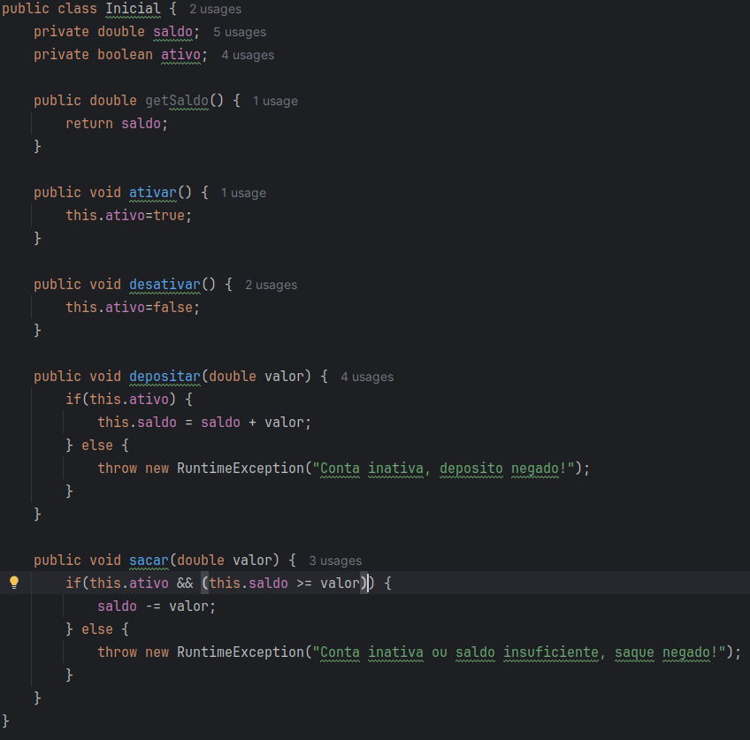
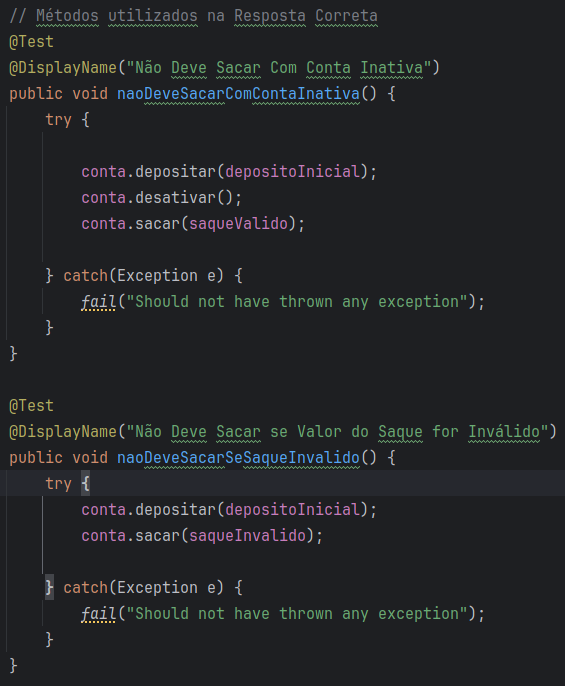
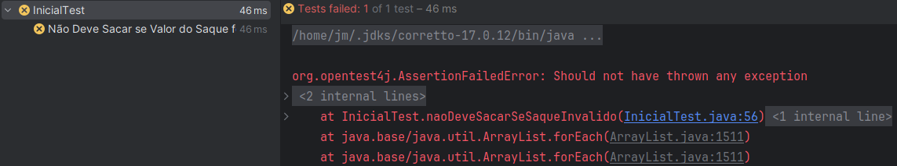
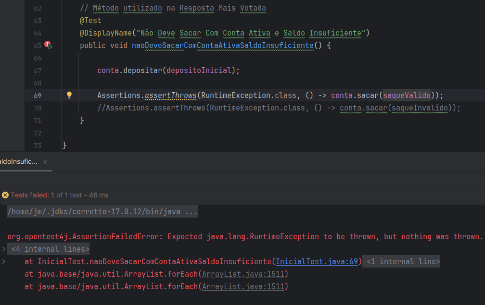
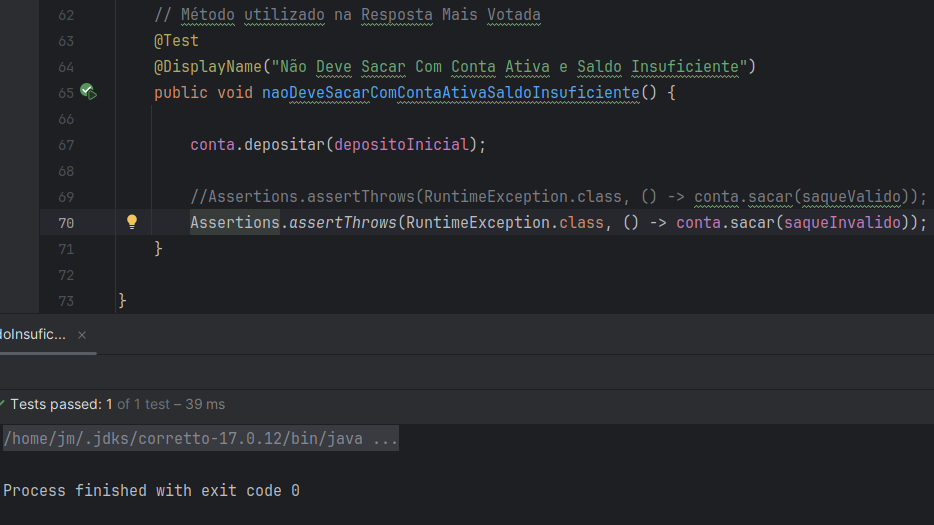

# Atividade 1 de Teste de Software - T01 2024.1
## Aluno: JOAO MARCOS P. CAVALCANTE
[Link para Repositório Github](https://github.com/JoaoMarcosPC/Teste_Software_2024_Cavalcante_Joao)

- [Escolha do Problema](#escolha-do-problema)
- [Descrição do Problema](#descrição-do-problema)
- [Código que está sendo testado](#código-que-está-sendo-testado)
- [Resposta Correta](#resposta-correta)
- [Análise das Demais Respostas](#análise-das-demais-respostas)
---
---
#### Escolha do Problema
- Foi feita uma pesquisa no StackOverflow com a seguinte string: "[unit-testing] or [junit] or [pytest]". As perguntas então foram ordenadas decrescentemente baseada na pontuação, a pergunta escolhida deveria ter uma resposta correta e no mínimo 400 votos. Procurei preferecialmente uma pergunta envolvendo JUnit.
- Importante resaltar que foi utilizado o JUnit 5.8.1 para realizar esse projeto, sendo que em qualquer versão do JUnit5 o projeto também funcionará.
---

#### Descrição do Problema
- O problema é "How to test that no exception was thrown?", ou "Como testar que não foi lançada nenhuma exceção?". O usuário fornece um bloco de código demonstrando como ele "captura" exceções que talvez sejam lançadas durante o teste e pergunta se não há uma forma mais eficiente de fazer essa verificação, até sugerindo um recurso do JUnit chamado **@Rule**. 
    - 
- Todas as demonstrações de código (da pergunta, da resposta correta e das demais respostas) estão no arquivo InicialTest, que está localizado em *./codigo/Pergunta/scr/test/java/InicialTest.java*
- Inicialmente foi implementada a forma como o usuário verifica se as exceções foram lançadas durante o teste:
    - 
- Como o depósito foi feito mesmo a conta estando desativada uma exceção foi lançada e "capturada", resultando em falha no teste.
---

#### Código que está sendo testado
- Para realizar os testes esse programa que simula funções básicas de uma conta bancária foi usado:
- 
----

#### Resposta Correta
- Antes de tratar da pergunta em si o autor da resposta escreve um material detalhando conceitos testes unitários.
- O autor da resposta correta identifica que o autor da pergunta poderia dividir o teste em dois: um para identificar uma entrada válida e outro para identificar uma entrada errada. Sugerindo que o autor da pergunta divida o teste em dois para conseguir identificar possíveis problemas no código de forma mais precisa.
    - 
- A seguir as exceções lançadas por cada método:
    - 
    - 
- No entanto, nessa resposta nenhuma solução referente ao tratamento de exceções utilizando recuros do *JUnit* é disponibilizada.
---

#### Análise da Resposta Mais Votada
- O autor da resposta mais votada é mais preciso com sua resposta, ele apresenta métodos específicos do *JUnit* para se lidar com exceções:
    - `assertAll()`
    - `assertDoesNotThrow()`
    - `assertThrows()`
- Para este projeto é implementado o `assertThrows()`, que verifica se o executável que foi fornecido lança uma exceção, verificando também se o tipo de exceção corresponde a um tipo específico que é determinado no método.
- Nessa primeira situação como o valor do saque é válido, o programa executa corretamente e não lança uma exceção. Assim o teste falha, já que a condição de sucesso é que uma exceção seja lançada:
    - 
- Na segunda situação o valor do saque é inválido e uma exceção é lançada, resultando em sucesso no teste:
    - 
---
---